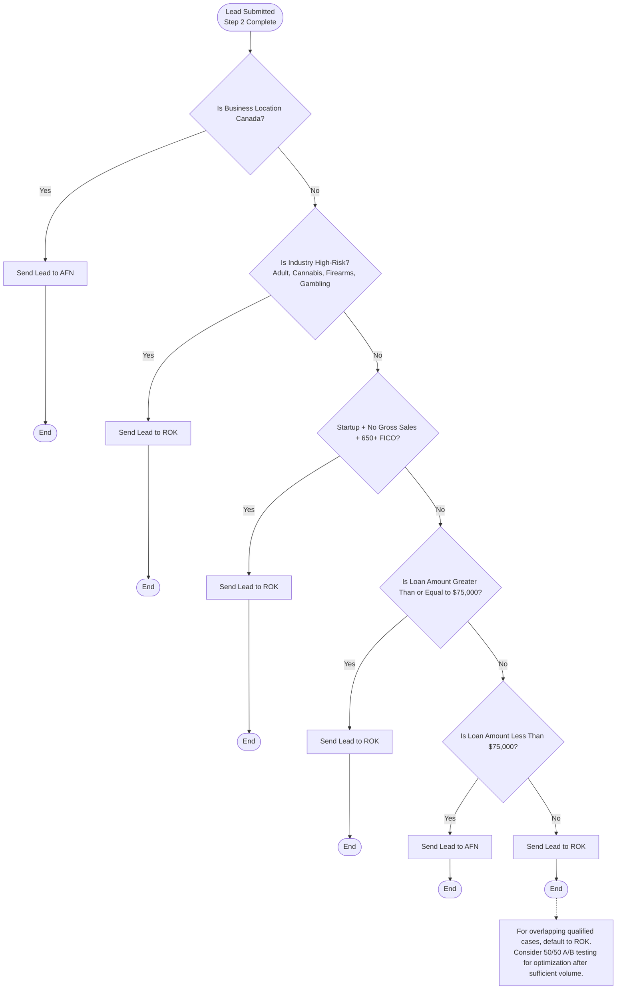

# Business Funding Lead Routing Flow

## Implemented Rules

- Canada business location routes to AFN.
- High-risk industries route to ROK:
  - Adult
  - Cannabis
  - Firearms / Ammunition
  - Casino / Gambling / Sports Clubs
- Startup businesses with no gross sales and 650+ FICO route to ROK.
- Other industries route by amount:
  - Loan amount `< $75,000` routes to AFN
  - Loan amount `>= $75,000` routes to ROK
- For overlapping qualified cases, default to ROK.

## API Endpoint for Decision

- `POST /api/leads/route-decision`
- Body:
  - `business_location` (optional)
  - `industry` (optional)
  - `loan_amount` (optional number/string)
  - `credit_score` (optional)
  - `sub_id_1` (optional)
  - `sub_id_2` (optional)
- Returns:
  - `partner`: `AFN` or `ROK`
  - `reason`: rule reason
  - `targetUrl`: routed destination URL with tracking params
